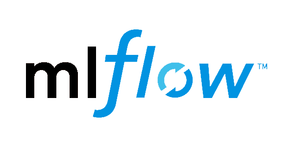

# Machine Learning Operations (MLOps) zoomcamp

This is a 3 months long program that focuses on hands on practice in MLOps.

The course consists of weekly modules and homework. The final weeks, one needs to develop a machine learning project from scratch to finish the course and get the certificate.

## Topics covered:
1. Introduction
1. Experiment tracking and model management
1. Orchestration and ML Pipelines
1. Model Deployment
1. Model Monitoring
1. Best Practices
1. Project

## Tools/tech used:

    
    
    
    
    
    

*https://github.com/DataTalksClub/mlops-zoomcamp/tree/main
